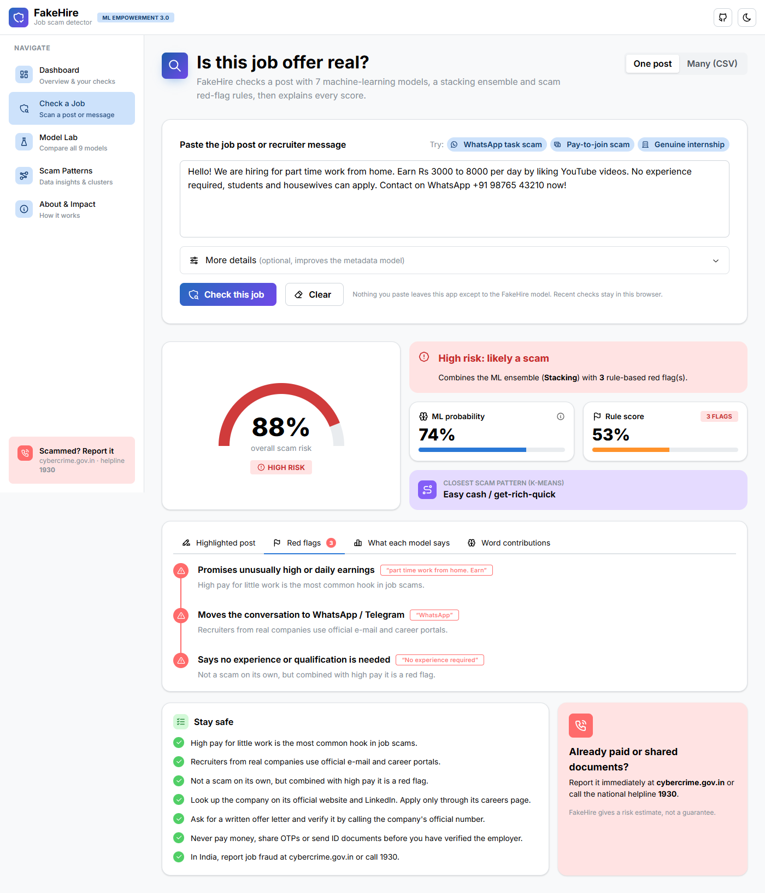
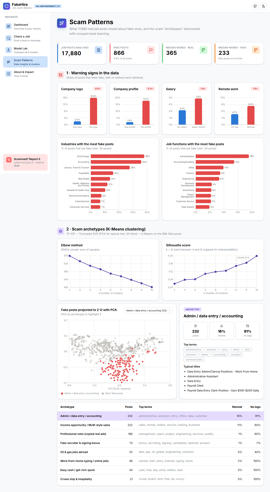
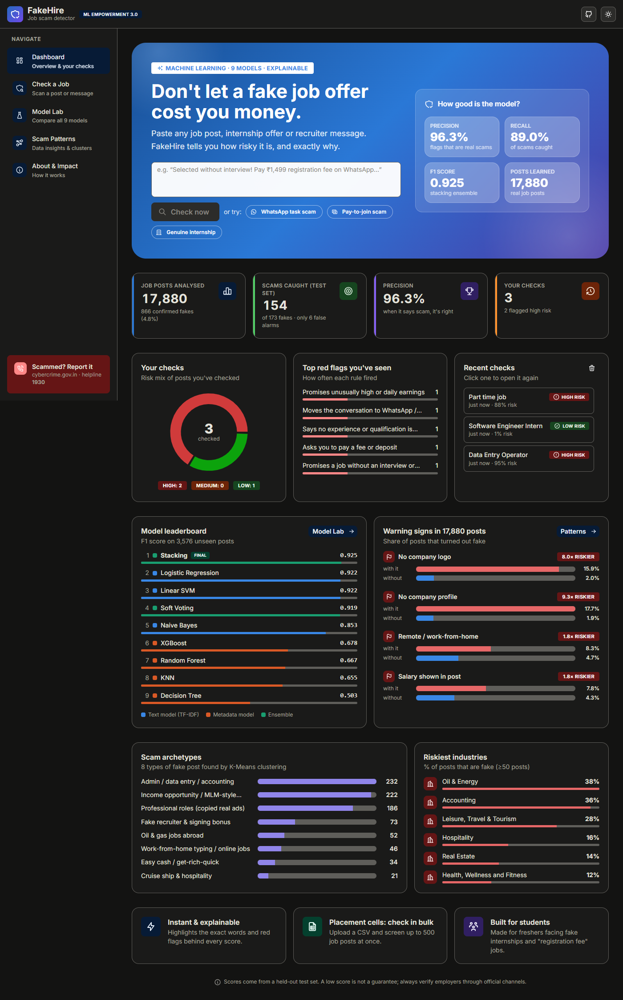
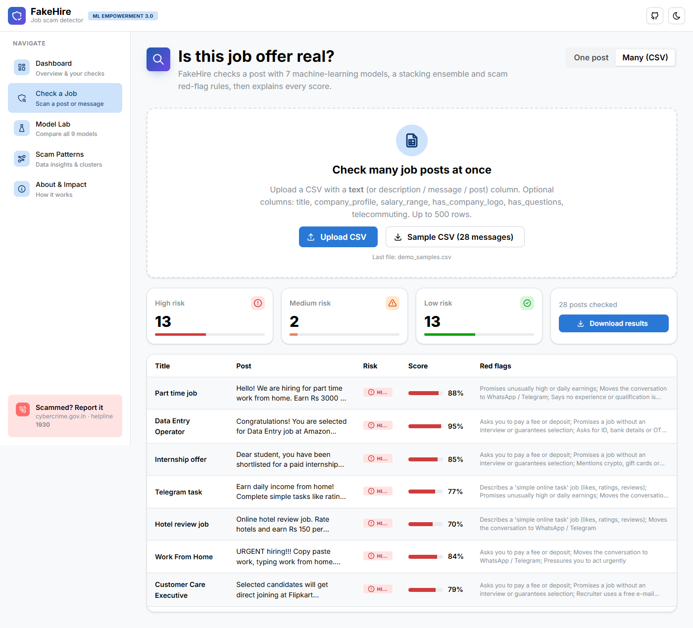
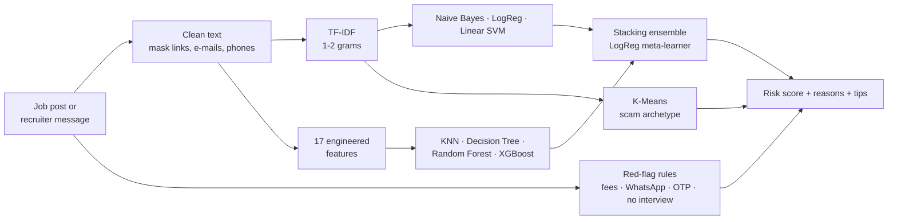

<div align="center">


# FakeHire

### Spot fake job & internship offers before they cost you money

Paste a job post or recruiter message and get a **scam-risk score**, the **exact red flags** behind it, and **what to do next**,
powered by 7 machine-learning models and a stacking ensemble.


**F1 0.925 · Precision 96.3% · Recall 89.0%** on 3,576 unseen job posts

[Features](#-features) · [How it works](#-how-it-works) · [Results](#-results) · [Quick start](#-quick-start) · [API](#-api) · [Deploy](#-deploy)

<sub>Built for the <b>ML Empowerment Build Challenge 3.0</b> and a college Machine Learning course project.</sub>

</div>

---


## 🚨 The problem

*"Congratulations! You are selected without interview. Pay ₹1,499 registration fee and send your Aadhaar on WhatsApp."*

Fake job and internship offers are one of the fastest-growing kinds of online fraud. They target **students, freshers and
people desperate for work**, and they cost victims money, time and sometimes their identity documents. Job seekers have no
quick way to tell a real offer from a scam, and a plain "spam / not spam" answer doesn't help them decide what to do.

**FakeHire** gives anyone an instant, **explainable** second opinion.

## ✨ Features

| | |
|---|---|
| 📊 **Dashboard** | Model-quality stats, *your* recent checks (risk mix, most common red flags), model leaderboard, warning signs, scam archetypes and the riskiest industries, all on one page. |
| 🔍 **Check a Job** | Risk gauge (Low / Medium / High), suspicious words highlighted in the post, red-flag timeline, closest scam pattern, safety tips and where to report fraud. |
| 🧠 **Every model's opinion** | See the probability from all 9 models side by side, plus per-word contributions from the Logistic Regression model. |
| 📁 **Batch mode** | Upload a CSV and screen up to 500 posts at once (for college placement cells), then download the results. |
| 🧪 **Model Lab** | Full comparison: metrics table, ROC and PR curves, confusion matrices, feature importance, class-imbalance experiment. |
| 🧭 **Scam Patterns** | Insights from 17,880 real posts, plus 8 scam archetypes discovered with K-Means and visualised with PCA. |
| 🌗 **Polished UI** | Light and dark themes, animated transitions, fully responsive down to phone screens. |

<table>
  <tr>
    <td width="50%"><p align="center"><sub>Check a job: risk gauge and explanation</sub></p></td>
    <td width="50%"><p align="center"><sub>Red flags with safety tips</sub></p></td>
  </tr>
  <tr>
    <td width="50%"><p align="center"><sub>Model Lab: all 9 models compared</sub></p></td>
    <td width="50%"><p align="center"><sub>Scam patterns and K-Means archetypes</sub></p></td>
  </tr>
  <tr>
    <td width="50%"><p align="center"><sub>Dark mode</sub></p></td>
    <td width="50%"><p align="center"><sub>Batch check from a CSV</sub></p></td>
  </tr>
</table>

## ⚙️ How it works



**Overall risk** = 1 − (1 − P<sub>ML</sub>) × (1 − P<sub>rules</sub>). The ML score and the rule evidence are always shown
separately, so users see *why* a post was flagged.

### Machine-learning techniques

| Task | Technique | Models |
|---|---|---|
| Text classification | TF-IDF + supervised learning | Multinomial Naive Bayes · Logistic Regression · Linear SVM |
| Tabular classification | Feature engineering + supervised learning | KNN · Decision Tree · Random Forest · XGBoost |
| Ensemble learning | Soft voting and stacking | Logistic Regression meta-learner |
| Unsupervised learning | Dimensionality reduction + clustering | Truncated SVD / PCA · K-Means (elbow + silhouette) |
| Imbalanced learning | Cost-sensitive learning vs oversampling | Class weights · SMOTE · threshold tuning |
| Explainability | Coefficients and feature importance | Per-word LogReg contributions · tree importances |

**Evaluation protocol.** Stratified 80/20 split. 5-fold stratified cross-validation on the training set produces
out-of-fold probabilities, which are used to tune each model's threshold, pick the best base models and train the
stacker without leakage. **The test set is used exactly once.**

## 📈 Results

Held-out test set: **3,576 posts, 173 of them fake** (only 4.8% of posts are fake, so accuracy alone would be
misleading).

| Model | Family | CV PR-AUC | Precision | Recall | F1 | ROC-AUC | PR-AUC |
|---|---|---|---|---|---|---|---|
| Naive Bayes | text | 0.861 | 0.851 | 0.855 | 0.853 | 0.992 | 0.921 |
| Logistic Regression | text | 0.915 | 0.957 | 0.890 | 0.922 | 0.993 | 0.957 |
| Linear SVM | text | 0.914 | 0.962 | 0.884 | 0.922 | 0.993 | 0.955 |
| KNN | metadata | 0.695 | 0.675 | 0.636 | 0.655 | 0.947 | 0.747 |
| Decision Tree | metadata | 0.419 | 0.401 | 0.676 | 0.503 | 0.880 | 0.503 |
| Random Forest | metadata | 0.713 | 0.701 | 0.636 | 0.667 | 0.964 | 0.774 |
| XGBoost | metadata | 0.685 | 0.680 | 0.676 | 0.678 | 0.949 | 0.758 |
| Soft Voting | ensemble | 0.914 | 0.956 | 0.884 | 0.919 | 0.995 | 0.957 |
| 🏆 **Stacking (final)** | ensemble | **0.921** | **0.963** | **0.890** | **0.925** | **0.995** | **0.961** |

- **154 of 173 scams caught**, with only **6 false alarms** among 3,403 real jobs.
- On 28 hand-written Indian-style messages (`data/demo_samples.csv`), **all 15 scams** are flagged Medium or High and
  **all 13 genuine posts** are rated Low.
- Posts **without a company logo are 8× more likely** to be fake, and posts without a company profile are 9× more likely.

## 🚀 Quick start

**Requirements:** Python 3.12, Node 20+

```bash
git clone https://github.com/inslot2525-ctrl/ML_CP.git
cd ML_CP

# Backend
python -m venv .venv
.venv\Scripts\activate                 # macOS/Linux: source .venv/bin/activate
pip install -r requirements-dev.txt

# Frontend (build once)
cd frontend && npm install && npm run build && cd ..

# Run everything on one server
uvicorn api.main:app --port 8000       # open http://localhost:8000
```

The trained models (`models/`) and results (`reports/`) are committed, so the app runs **without** the raw dataset.

<details>
<summary><b>Development mode (hot reload)</b></summary>

```bash
uvicorn api.main:app --reload --port 8000   # terminal 1
cd frontend && npm run dev                  # terminal 2 → http://localhost:5173 (proxies /api)
```
</details>

<details>
<summary><b>Retrain the models</b></summary>

Download the Kaggle dataset **“Real or Fake Job Posting Prediction”** (EMSCAD) to `data/raw/fake_job_postings.csv`, then:

```bash
python -m src.eda        # EDA numbers + figures        → reports/eda.json
python -m src.train      # all 9 models (~2 min)        → models/, reports/metrics.json
python -m src.cluster    # K-Means scam archetypes      → reports/clusters.json
pytest -q                # 16 tests (ML + API)
```
</details>

## 🔌 API

| Method | Endpoint | Description |
|---|---|---|
| `POST` | `/api/predict` | Score one post: JSON `{ "text": "...", "title": "", "company_profile": "", "has_logo": null, ... }` |
| `POST` | `/api/predict-batch` | Score a CSV upload (`multipart/form-data`, field `file`, up to 500 rows) |
| `GET` | `/api/metrics` | Metrics, curves, confusion matrices and feature importance for all models |
| `GET` | `/api/clusters` | K-Means archetypes and PCA points |
| `GET` | `/api/eda` | Dataset insights |
| `GET` | `/api/demo-csv` | The 28-message demo CSV |

Interactive docs: **http://localhost:8000/docs**

```bash
curl -X POST http://localhost:8000/api/predict -H "Content-Type: application/json" \
     -d '{"text": "Selected without interview! Pay Rs 1499 registration fee on WhatsApp."}'
```

## 🗂️ Project structure

```
├── api/            FastAPI backend (REST API + serves the React build)
├── src/            ML: preprocess · features & red-flag rules · train · ensemble · cluster · eda · predict
├── frontend/       React + TypeScript (Vite, Mantine, Tabler icons, Motion, React Router, Recharts)
│   └── src/pages/  Dashboard · CheckJob · ModelLab · ScamPatterns · About
├── models/         Trained models (joblib)
├── reports/        metrics.json · clusters.json · eda.json · figures/
├── notebooks/      01 EDA · 02 model comparison · 03 clustering
├── data/           demo_samples.csv (raw Kaggle data is not committed)
├── docs/           Course report · Devpost write-up · demo video script · screenshots
├── tests/          pytest suite (model + API)
└── Dockerfile      One container: builds the frontend and runs FastAPI
```

## ☁️ Deploy

The `Dockerfile` builds the React app and serves it with FastAPI in **one container**.

- **Render** (free): New → Web Service → connect this repo → Runtime **Docker**. `PORT` is set automatically.
- **Hugging Face Spaces**: create a **Docker** Space from this repo and set the variable `PORT=7860`.

## ⚠️ Limitations and ethics

- The EMSCAD data is mostly **US job posts from 2012–14**, so the models also learn some dataset-specific words (for
  example the company names "Accion" and "Aker"). Indian-style scams (WhatsApp "task" jobs, registration fees) are rare
  in it, which is why a transparent **rule layer** is added and always shown separately.
- A low score is **not a guarantee**. Always verify an employer through official channels.
- False positives can unfairly flag small or new companies, so FakeHire always explains its reasons.
- Check history is stored only in the user's browser.

**Scammed? In India, report it at [cybercrime.gov.in](https://cybercrime.gov.in) or call 1930.**

## 📚 Documentation

- [Course report](docs/course_report.md): methodology, results, discussion
- [Devpost submission](docs/devpost_submission.md)
- [Demo video script](docs/demo_video_script.md)
- Notebooks: [EDA](notebooks/01_eda.ipynb) · [Model comparison](notebooks/02_model_comparison.ipynb) · [Clustering](notebooks/03_clustering.ipynb)

## 👥 Team

| Name | Role |
|---|---|
| _Your name_ | ML modelling, backend, frontend, documentation |

## 🙏 Acknowledgements

- Dataset: Vidros, Kolias, Kambourakis & Akoglu (2017), *Automatic Detection of Online Recruitment Frauds*, **EMSCAD**,
  University of the Aegean (via Kaggle)
- [ML Empowerment Foundation](https://www.instagram.com/mlempowermentfoundation/) for the Build Challenge
- Built with scikit-learn, XGBoost, imbalanced-learn, FastAPI, React, Mantine and Recharts
