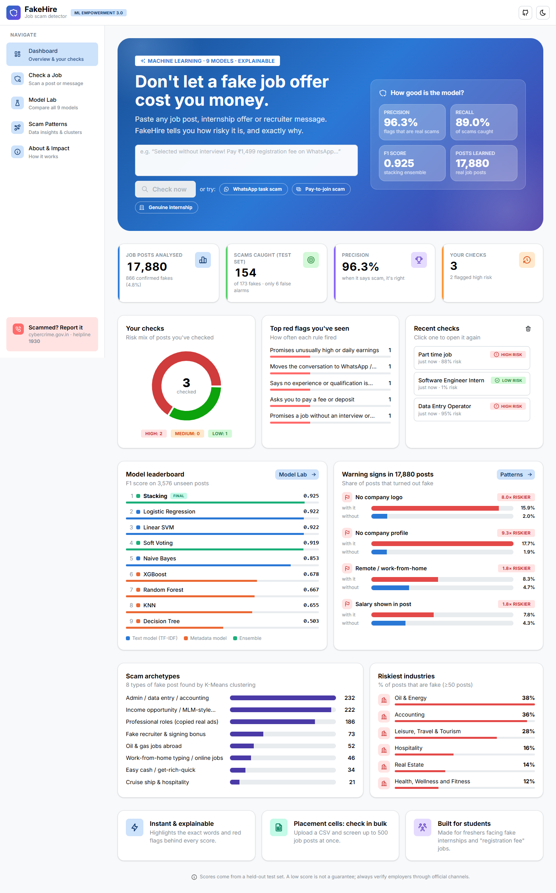
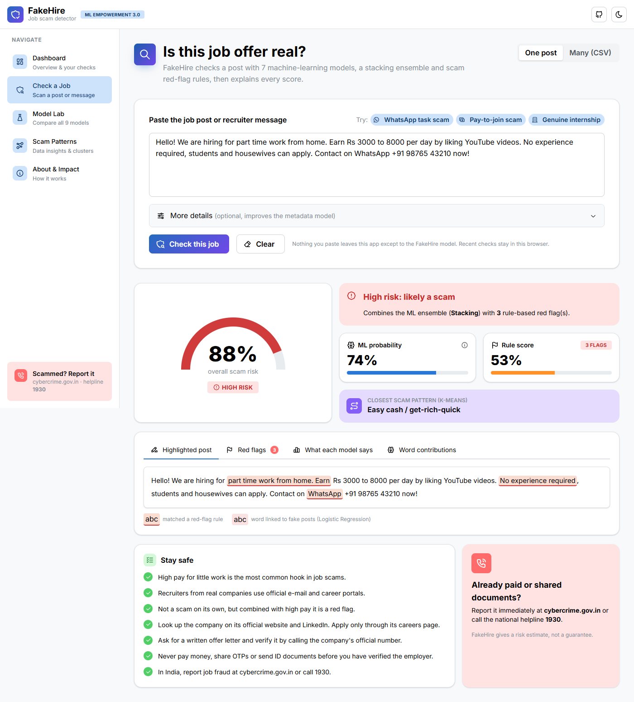
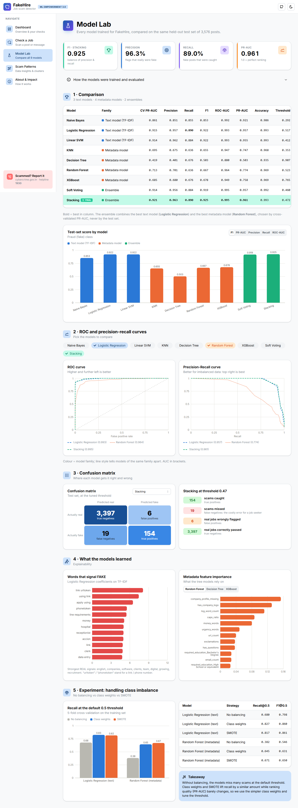

# 🛡️ FakeHire: Fake Job & Internship Scam Detector

> Paste a job post or recruiter message → get a scam-risk score, the exact red flags behind it, and safety advice.
> Built with 7 classic ML models, a stacking ensemble, K-Means clustering and transparent rules.
> **React + TypeScript + Mantine** frontend · **FastAPI** backend · scikit-learn / XGBoost models.

**ML Empowerment Build Challenge 3.0 submission** · also a college Machine Learning course project.



## The problem
Fake job and internship offers target students and freshers on WhatsApp, Telegram and job portals: *"Selected
without interview! Pay ₹1,499 registration fee."* Victims lose money, and sometimes their identity documents, at the
moment they can least afford it. FakeHire gives anyone an instant, explainable second opinion.

## What it does
| Page | What you get |
|---|---|
| **Dashboard** | Gradient hero with a quick check box, model-quality stats, *your* recent checks (risk mix, most common red flags, history kept in the browser), model leaderboard, warning signs, scam archetypes, riskiest industries. |
| **Check a Job** | Risk gauge (Low/Medium/High), highlighted suspicious words, red-flag rules, closest scam archetype, what *every* model predicts, safety tips. Batch mode checks a whole CSV. |
| **Model Lab** | Side-by-side comparison of all models: metrics table, ROC/PR curves, confusion matrices, feature importance, the class-imbalance experiment. |
| **Scam Patterns** | EDA of 17,880 posts + 8 scam archetypes discovered with TF-IDF → SVD → K-Means, visualised with PCA. |
| **About & Impact** | Pipeline diagram, techniques, limitations and ethics, where to report fraud (cybercrime.gov.in · 1930). |

Light and dark themes, animated transitions, works on phones.



## Architecture
```
React (Vite + TypeScript + Mantine + Recharts)  ──HTTP/JSON──▶  FastAPI (api/main.py)  ──▶  src/predict.py  ──▶  models/*.joblib
        frontend/                                    /api/predict, /api/predict-batch,
                                                     /api/metrics, /api/clusters, /api/eda
```
In production, FastAPI also serves the built React app, so everything runs as **one service**.

## Machine learning
| Task | Models |
|---|---|
| Text classification (TF-IDF, 1–2 grams) | Multinomial Naive Bayes · Logistic Regression · Linear SVM |
| Metadata classification (17 engineered features) | KNN · Decision Tree · Random Forest · XGBoost |
| Ensemble | Soft Voting · **Stacking** (Logistic Regression meta-learner) |
| Unsupervised | Truncated SVD / PCA + K-Means (elbow + silhouette) |
| Imbalance (4.8% fake) | Class weights vs SMOTE vs none · threshold tuning on out-of-fold predictions |

**Evaluation protocol:** stratified 80/20 split; 5-fold stratified CV on the training set produces out-of-fold
probabilities used to tune thresholds, pick the best base models and train the stacker. The test set is used once.

### Results (held-out test set, 3,576 posts, 173 fake)
| Model | Family | CV PR-AUC | Precision | Recall | F1 | ROC-AUC | PR-AUC |
|---|---|---|---|---|---|---|---|
| Naive Bayes | text | 0.861 | 0.851 | 0.855 | 0.853 | 0.992 | 0.921 |
| Logistic Regression | text | 0.915 | 0.957 | 0.890 | 0.922 | 0.993 | 0.957 |
| Linear SVM | text | 0.914 | 0.962 | 0.884 | 0.922 | 0.993 | 0.955 |
| KNN | metadata | 0.695 | 0.675 | 0.636 | 0.655 | 0.947 | 0.747 |
| Decision Tree | metadata | 0.419 | 0.401 | 0.676 | 0.503 | 0.880 | 0.503 |
| Random Forest | metadata | 0.713 | 0.701 | 0.636 | 0.667 | 0.964 | 0.774 |
| XGBoost | metadata | 0.685 | 0.680 | 0.676 | 0.678 | 0.949 | 0.758 |
| Soft Voting | ensemble | 0.914 | 0.956 | 0.884 | 0.919 | 0.995 | 0.957 |
| **Stacking (final)** | ensemble | **0.921** | **0.963** | **0.890** | **0.925** | **0.995** | **0.961** |

On the 28-message hand-written Indian demo set (`data/demo_samples.csv`), all 15 scams are flagged Medium or High
and all 13 genuine posts are Low.



## Run it locally
**Backend (Python 3.12)**
```bash
python -m venv .venv
.venv\Scripts\activate            # macOS/Linux: source .venv/bin/activate
pip install -r requirements-dev.txt

# Optional, only to retrain. Dataset: Kaggle "Real or Fake Job Posting Prediction" → data/raw/fake_job_postings.csv
python -m src.eda                 # EDA numbers + figures
python -m src.train               # trains and compares all models (~2 min)
python -m src.cluster             # K-Means scam archetypes

pytest -q                         # 16 tests (ML + API)
uvicorn api.main:app --reload --port 8000
```

**Frontend (Node 20+)**, in a second terminal
```bash
cd frontend
npm install
npm run dev                       # http://localhost:5173 (proxies /api to :8000)
```

**Single-server mode** (what gets deployed)
```bash
cd frontend && npm run build && cd ..
uvicorn api.main:app --port 8000  # http://localhost:8000 serves the React app + API
```
Trained models (`models/`) and results (`reports/`) are committed, so the app runs without the raw dataset.

## Project structure
```
src/        preprocess · features (+ red-flag rules) · train · ensemble · cluster · eda · predict
api/        FastAPI backend (REST API + serves the React build)
frontend/   React + TypeScript app (Vite, Mantine UI, Tabler icons, Motion, React Router, Recharts)
  src/pages/  Dashboard · CheckJob · ModelLab · ScamPatterns · About
notebooks/  01 EDA · 02 model comparison · 03 clustering (course walkthrough)
reports/    metrics.json · clusters.json · eda.json · figures/
docs/       Devpost write-up · course report · demo video script · screenshots
tests/      pytest suite
```

## Deploy (free)
The repo includes a `Dockerfile` that builds the React app and runs FastAPI in one container.

- **Render** (free web service): New → Web Service → connect the GitHub repo → Runtime: *Docker*. Render sets `PORT`
  automatically.
- **Hugging Face Spaces**: create a *Docker* Space, push the repo, and add the variable `PORT=7860` in the Space settings.

Both give you a public URL for the Devpost "live demo" link.

## Limitations
The EMSCAD dataset contains mostly US posts from 2012–2014, so the ML models also learn some dataset-specific
tokens (for example company names like "Accion" and "Aker"). Indian-style scams (WhatsApp task jobs, registration
fees) are rare in the data, which is why FakeHire adds a transparent rule layer and always shows its reasons.
A low score is not a guarantee.

## Team
| Name | Role |
|---|---|
| _Your name_ | ML, backend, frontend, documentation |

Dataset: Vidros et al., *EMSCAD*, University of the Aegean (via Kaggle). License: MIT for code.
